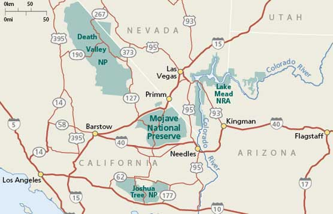

### Magnet hypothesis: plant-pollinator interactions
**Purpose:** A test of the magnet hypothesis was examined in Mojave National Preserve by Ally Ruttan.    

**Hypothesis:** Floral resource island created by shrubs and the associated beneficiary annual plants will positively and non-additively influence pollinator visitation rates. 

**Predictions:**  
(1) The frequency and duration of pollinator visitations to annuals is greater under shrubs than in the paired-open microsites (magnet H because of concentration).  
(2) Annual plants under flowering entomophilous shrubs (*Larrea tridentata*) will have a higher frequency and duration of pollinator visitations than annual plants under anemophilous shrubs (*Ambrosia dumosa*) because of higher concentrations of suitable floral resources for pollinators (specificity of pollinator faciliation).  
(3) Shrubs with annuals in their understory will have a higher frequency and duration of pollinator visitations than shrubs without annuals due to increased concentrations of floral resources for pollinators (reverse magnet effect and reciprocal benefits).  
(4) Sites with both shrubs and annuals will have the highest frequency and duration of pollinator visitations to both the shrubs and the annuals (i.e. annuals under shrubs also with flowers are visited the most).

An interesting corollary is that there are appropriate floral resources for desert pollinators, that they discriminate, and that entomophilous and anemophilous shrubs facilitate flowering similarly.



###Data wrangling
```{r library and data loads, warning=FALSE, message=FALSE}
#libraries####
library(tidyverse)
library(DT)
library(lubridate)

#meta-data####
meta <- read_csv("data/meta-data.csv")
datatable(meta)
#error is SD

#data####
data.2015 <- read_csv("data/MNP.2015.csv")
data.2016 <- read_csv("data/MNP.2016.csv")

#merge
data <- rbind.data.frame(data.2015, data.2016)

#code treatment properly
data <- data %>% rename(net.treatment = treatment) #%>% na.omit(data) 

#keep key columns and minimize working dataframe
data <- data %>% select(-name, -plant, -start, -stop, -ID, -recorder)

#set year and rep as characters
data$year <- as.character(data$year)
data$rep <- as.character(data$rep)

#convert times to total seconds then to hour
data$total.duration <- (as.numeric(data$total.duration))/3600
data$visitation.duration <- (as.numeric(data$visitation.duration))/3600

#recode net.treatment column
data <- data %>% mutate(net.treatment = ifelse(net.treatment %in% c("SA"), "Larrea flowers with annuals", ifelse(net.treatment %in% c("SX"), "Larrea flowers without annuals", ifelse(net.treatment %in% c("SAA"), "Annual flowers under Larrea",ifelse(net.treatment %in% c("OA"), "Annual flowers in open",ifelse(net.treatment %in% c("AMB"), "Annual flowers under Ambrosia","NA"))))))

#frequency wrangled by RTU####
frequency <- data %>% group_by(year, day, net.treatment, rep, insect.RTU) %>% 
  summarise(net.time = sum(total.duration), mean.temp = mean(temperature), net.visitation = sum(visitation.duration), mean.visitation.duration = mean(visitation.duration), net.floral.density = sum(floral.density), mean.floral.density = mean(floral.density), insect.richness = n_distinct(insect.RTU), count = n())

#richness in RTU
#richness <- frequency %>% group_by(year, day, net.treatment, rep) %>% summarise( insect.richness = mean(insect.richness))

#rates needed
frequency <- frequency %>% mutate(rate.per.flower = (count/net.floral.density)*100) %>% mutate(rate.per.flower.hr = rate.per.flower/net.time)

#view data
datatable(frequency)

freq.2015 <- frequency %>% filter(year == 2015)
freq.2016 <- frequency %>% filter(year == 2016)
freq.rtu <- frequency %>% filter(insect.RTU != "none") %>% filter(rate.per.flower.hr <40) %>% filter(net.visitation <2)
```

### Data visualization
```{r viz, warning=FALSE, message=FALSE}
ggplot(freq.rtu, aes(net.treatment, count, fill = insect.RTU)) + geom_boxplot() + ylab("count") + scale_fill_brewer(palette = "Blues") + facet_wrap(~year) + coord_flip()

ggplot(freq.rtu, aes(net.treatment, rate.per.flower.hr, fill = insect.RTU)) + geom_boxplot() + ylab("rate per flower per hour") + scale_fill_brewer(palette = "Blues") + facet_wrap(~year) + coord_flip()

ggplot(freq.rtu, aes(net.treatment, net.visitation, fill = insect.RTU)) + geom_boxplot() + ylab("net duration of visits") + scale_fill_brewer(palette = "Blues") + facet_wrap(~year) + coord_flip()

ggplot(freq.rtu, aes(mean.temp, rate.per.flower.hr, color = insect.RTU)) + geom_point() + ylab("net duration of visits") + facet_wrap(~year)

ggplot(freq.rtu, aes(mean.temp, net.visitation, color = insect.RTU)) + geom_point() + ylab("net duration of visits") + facet_wrap(~year)


```

###Models
```{r models, warning=FALSE, message=FALSE}
#visitations
m1 <- glm(rate.per.flower.hr~net.treatment + insect.RTU %in% rep + mean.temp, family = "poisson", data = freq.2015)
anova(m1, test = "Chisq")
require(lsmeans)
lsmeans(m1, pairwise~net.treatment, adjust="tukey")

m2 <- glm(rate.per.flower.hr~net.treatment + insect.RTU %in% rep + mean.temp, family = "poisson", data = freq.2016)
anova(m2, test = "Chisq")
lsmeans(m2, pairwise~net.treatment, adjust="tukey")

#duration of visits
m1 <- glm(net.visitation~net.treatment + insect.RTU %in% rep + mean.temp, family = "poisson", data = freq.2015)
anova(m1, test = "Chisq")
lsmeans(m1, pairwise~net.treatment, adjust="tukey")

m2 <- glm(net.visitation~net.treatment + insect.RTU %in% rep, family = "poisson", data = freq.2016)
anova(m2, test = "Chisq")
lsmeans(m2, pairwise~net.treatment, adjust="tukey")

```

###Interpretation
